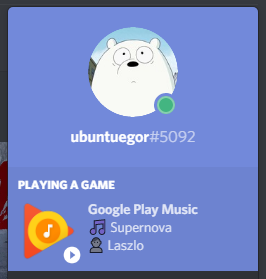

# Last.FM Discord Rich Presence
Initially made to show now playing track from Google Play Music, using [scroblr](http://scroblr.fm/). 
You can [create your own app](https://discordapp.com/developers/applications/me) to use it for your needs. 

# How to use
1. Download this repository.
2. Install dependencies `npm install`.
3. Modify config.json.
4. Run `npm start`.
# Run in background
1. Install PM2 `npm install pm2 -g`
2. Run `pm2 start app.js --name="lastfm-drp"`
